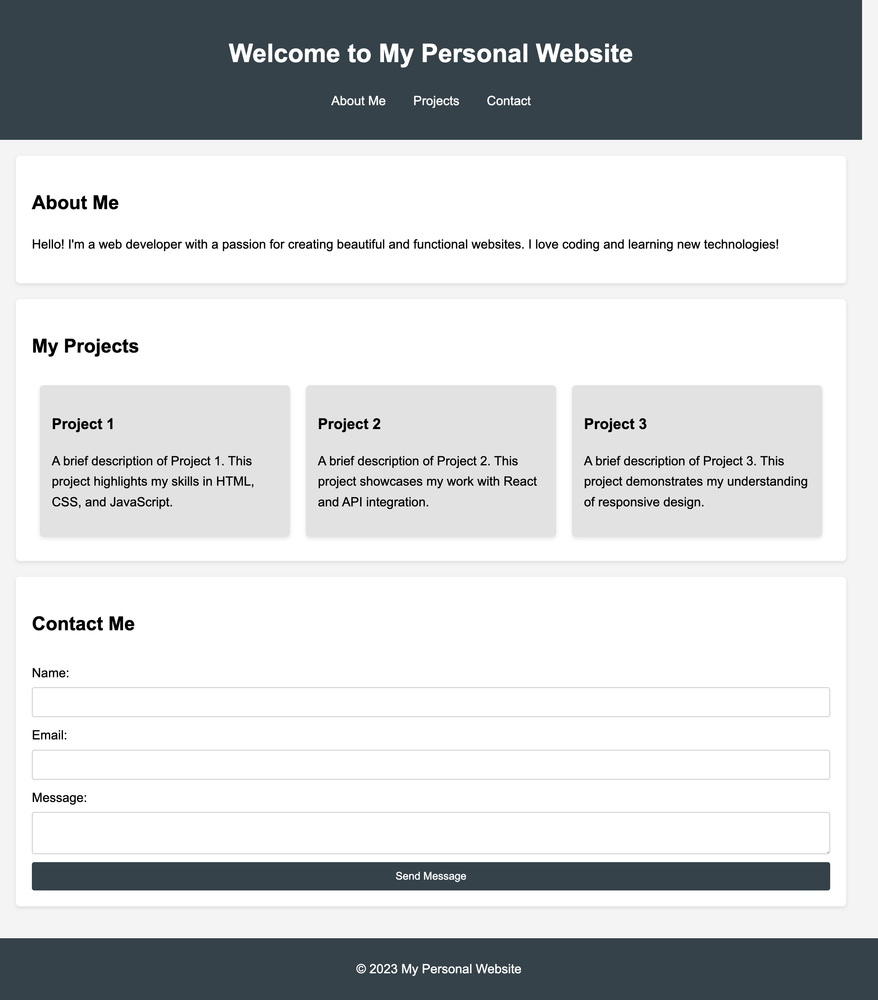

[](https://classroom.github.com/open-in-codespaces?assignment_repo_id=19570987)
# afd-breakout-activity-flex-box-

# Personal Website Project

## Learning Objectives
- Understand Flexbox and its properties.
- Apply CSS styles to HTML elements.
- Create a responsive layout using Flexbox.

## Starter Code
This project includes a basic HTML structure and CSS styles to help you get started with your personal website.

### HTML Structure
- `index.html`: Contains the main structure of the website.
- `styles.css`: Contains the styles using CSS Flexbox.

### How to Get Started
1. **Clone the Repository**: 
   ```bash
   git clone [YOUR_REPOSITORY_URL]
2. **Open in Your Editor:** Open the project folder in your code editor.
3. **Link CSS:** Ensure that styles.css is linked correctly in the index.html file.
4. **Modify Styles:** Use Flexbox properties to style the layout as per the project requirements.
5. **Test Responsiveness:** Check how your layout adjusts on different screen sizes.
6. **Submit Your Work:** Once completed, commit your changes and push them to your repository.

## Example Solution
Here’s an example of what your completed personal website should look like:


